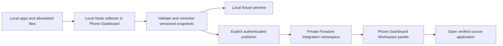

# Unified workspace / Phone Dashboard integration specification

Status: planning complete; architecture below is the recommended execution design, not deployed behavior. Date: 2026-09-06.

## Outcome

Phone Dashboard is the user's single place to see workspace app status, useful summaries, freshness, and links to detailed tools. Claude and Codex implement it from one shared plan and status ledger. Domain logic and source records stay in their owning projects.

The user selected Phone Dashboard as the destination. A separate workspace-dashboard application is out of scope. The integration code lives inside `phone-dashboard/integrations/` and `phone-dashboard/scripts/integrations/`.

## Inventory and source ownership

Paths below are relative to the Projects workspace unless explicitly marked otherwise. Existence was checked on 2026-09-06; operational availability and hosted URLs must be verified during execution. `KNOWLEDGE-BASE.md` is an older inventory, not live-state evidence.

| Source | Dashboard integration | Authoritative input | Initial boundary |
|---|---|---|---|
| Phone Dashboard | Existing Today, routines, money, check-ins; new Workspace area | `phone-dashboard/index.html`, `CLAUDE.md`, `HANDOFF.md` | Preserve existing behavior and Firestore records |
| Encore | Catalogue freshness/counts and source link; selected picks only after field/evidence mapping | `encore/src/serve.mjs`: GET `/api/products`, GET `/api/status`; `encore/web/shared/`; `NUMBER_RULES.md` | Source computes economics; no recalculation or bidding in FLOWSTATE |
| AI Trading Lab | Reachability, trading mode, guardrail status; optional sanitized summary | `ai-trading-lab/src/dashboard/app.py`: GET `/api/health`, GET `/api/summary`; `PROJECT_DETAILS.md` | Summary can call market providers and contain portfolio values; disabled by default until allowlist review; no trade execution |
| Sleepforge | Ledger availability, completed episode count, latest known render/upload stage | `sleep-sounds-channel/src/sleepforge/catalogue.py`, `cli.py`, `out/ledger.json` | Ledger entry/video ID does not prove publication, schedule success, or public visibility |
| FANBOX downloader | Optional private operations card: manifest availability and aggregate download status | `fanbox-image-scraper/README.md`, configured output `manifest.json` | No images, titles, cookies, creator URLs, browser profile, or local paths in cloud payload |
| Anchor Context | Reference entry and explicitly selected document metadata | `anchor-context/profile/` | No automatic profile-content upload |
| AI Memory Portability | Project-stage/reference entry | `ai-memory-portability/BUILD-PREP.md`, `RESEARCH.md` | Planned project; do not label an MCP service connected merely because the design exists |
| Personal Hub | Private reference entry; provenance for any future manual migration | `Satya - Personal Hub/00_START_HERE.md` | Never bulk upload archive, spreadsheets, or create a competing copy of FLOWSTATE |
| PR documents | Private reference entry only | `PR - All doc - Copy/` | No recursive reads, index, upload, document names, or sensitive contents |
| Graphify | Developer-only graph freshness and verified counts, optional local link | `graphify-out/graph.json`, `.graphify_root`, report | Graph covers only a subset of workspace; graph files stay local |

`Notes`, `.claude-projects`, `.agents`, `.codex`, `.claude`, `.github`, `skill-observations`, and archives are support material, not extra running apps. Include an Apps directory entry for every row above; reference-only entries must visibly say "Reference only". Remote access to local files is not implied by an entry.

## Data flow and deployment



The hosted phone must read authenticated HTTPS data. `localhost` on a phone points to the phone; desktop HTTP endpoints also cannot be relied on from an HTTPS PWA. The browser therefore does not poll desktop ports or read sibling folders. The collector runs on the laptop, with explicit configured source roots and base URLs, and publishes minimized snapshots through a separate manual command. When the laptop is off, snapshots become stale visibly.

Use the existing Firebase stack for the first remote transport, subject to inspecting actual deployed authorization rules. Proposed namespace: `users/{uid}/integrations/{sourceId}`. Browser reads are owner-only and browser writes to integration snapshots are denied. A local publisher may use the existing server-side Firebase Admin dependency with operator-provided credentials; Admin bypasses Firestore rules, so its code must restrict destination paths and fields and credentials stay outside the served repository. Do not assume client rules restrict Admin privileges. Production credentials/rules are not verified by this plan.

Prepare and test in emulators before live publication. Preserve current rules by adding the integration namespace to an inspected baseline; never replace production rules with a guessed complete file. If that baseline is unavailable, finish local fixtures/collector/UI and record cloud rollout as awaiting configuration. Do not invent a public JSON fallback.

The current Pages workflow uploads repository root (`.github/workflows/deploy.yml`, `path: .`). Before any runtime data or credential configuration can reside there, change packaging to an explicit app-shell allowlist. Runtime snapshots and local configuration belong outside the repository by default. Planning docs contain architecture only; private handoffs/configuration must never be added to the published artifact.

## Version 1 contract

One current snapshot per source; no event bus/history service is needed for the first release.

```json
{
  "schemaVersion": 1,
  "sourceId": "encore",
  "observedAt": "2026-09-06T14:00:00Z",
  "sourceUpdatedAt": null,
  "expiresAt": "2026-09-06T14:15:00Z",
  "status": "ready",
  "reasonCode": null,
  "metrics": [{"key": "itemCount", "label": "Catalogue items", "value": 42, "unit": "count"}],
  "links": [],
  "revision": "sha256-of-canonical-payload"
}
```

- `sourceId`: fixed registry ID. Reject unregistered IDs and unknown keys; never forward upstream JSON wholesale.
- `observedAt`: collector time in UTC; `sourceUpdatedAt`: verified source-data timestamp or null; `expiresAt`: observation plus source TTL. A successful HTTP response does not make old source data current.
- Status enum: `ready`, `degraded`, `unavailable`, `not-configured`, `reference-only`. The UI additionally derives `stale` when current time exceeds expiry, or when a known source timestamp exceeds its allowed age. Future timestamps beyond 5 minutes are invalid.
- `reasonCode`: null or one of `timeout`, `unreachable`, `invalid-data`, `missing-file`, `not-configured`, `source-stale`; display fixed user copy, not raw exception messages.
- Metrics: maximum 8 allowlisted entries; primitive finite numbers, booleans, or capped strings only. Unknown financial values stay absent, never zero. Units are explicit; no aggregation of auction profit estimates into portfolio performance.
- Links: maximum 3 fixed-label HTTPS links from configured trusted hosts, no URL credentials/query tokens; local launch information stays in local config and becomes "Available on laptop" on phone. Reject `file:`, `javascript:`, arbitrary redirect hosts, and HTML payloads.
- Cap each serialized snapshot at 16 KiB and each displayed string at 160 characters. Compute revision over recursively key-sorted fields excluding `revision`; arrays retain order. Reject invalid snapshots before publishing.
- Defaults: 15-minute expiry for Encore, 5-minute expiry for trading health, 24 hours for Sleepforge/downloader/Graphify metadata, 7 days for reference entries. These measure observation freshness; do not infer market-data freshness from health checks. Reference entries have no live-health claim.
- Publisher transaction refuses older `observedAt` values; identical revision skips a write. One source failing does not remove another source or overwrite the last good snapshot. Persist an explicit failed-observation snapshot with status/reason where appropriate; retain good metrics separately only if their original timestamps remain visible.

## UI and behavior

Keep Today as the default view. Add Workspace with expandable sections for Money & research, Creative tools, and References. Each source row shows name, connection/state label, last checked time, data age where known, up to three useful headline metrics, and a source link where reachable. Full details stay in the owning app. Connection settings show setup instructions, without credential entry fields in the PWA.

Use existing typography/theme, 44px minimum targets, keyboard access, text labels for states, WCAG AA contrast, and reduced-motion behavior. Failure of an integration must not block Today, authentication, check-ins, or existing Firebase synchronization. Lazy-load integration modules after sign-in and only subscribe while Workspace is visible. Detach subscriptions on sign-out; clear in-memory source snapshots. Initial private-snapshot offline persistence is disabled; do not add integration responses to the service-worker cache.

No automatic new notifications in version 1. Existing reminder behavior is governed by current instructions and HANDOFF. Any later notification integration must use existing preferences, dedupe, quiet hours, and opt-in per source. Google Tasks remains the action source; Calendar remains timed commitments. A card link does not prove voice completion/synchronization.

## Shared development and Graphify

Keep each project repository separate. Phone Dashboard owns transport, view code, shared contract, tests, and plan. Add source-side exporters only where reading an existing allowlisted output is insufficient. Keep domain computations in their source project.

The audit saw 2,351 nodes, 4,250 edges, and 16 inferred/ambiguous cross-project edges. None proved a cross-project runtime flow. Graphify missed several folders listed above. Rebuild only explicit code/docs roots, excluding data, credentials, profiles, archives, browser state, and personal documents. Record source revision and scope with generated output; treat generated artifacts as reproducible navigation rather than editable source. Hooks are optional and project-scoped; no root Git repository exists.

Optimize the graph after the user-visible first slice: project/confidence/relation filters, hide low-degree nodes by default, correct undirected arrows, source-aware name matching, cached layout/hulls, and project-aware call-flow labels. These improvements must not delay app integration.

## Completion criteria

Every inventory row has an explicit source mode; Encore, trading health, and Sleepforge have tested adapters and phone-visible authenticated snapshots. Optional downloader is configured or honestly marked not configured. References remain reference-only. Phone shows stale data after collector shutdown; sign-out and a different UID cannot retrieve snapshots. Today still works. Packaging excludes private files. Both agents can resume from the same STATUS record with no reliance on prior chat history. Final evidence distinguishes local tests, deployed transport, deployed UI, and physical-phone checks.
